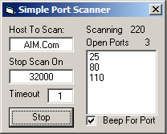



## A Port Scanner\.\.

### Description

Scans the given Hostname, Website or IP address given for open ports.
 
### More Info
 
Input Hostname, Website or IP Address Port to stop scan on and Timeout for each port.

Open Ports

             |
---                |---
**Submitted On**   |2002-09-29 22:08:12
**By**             |[Matt Johnson](https://github.com/Planet-Source-Code/PSCIndex/blob/master/ByAuthor/matt-johnson.md)
**Level**          |Beginner
**User Rating**    |4.0 (8 globes from 2 users)
**Compatibility**  |VB 5\.0, VB 6\.0
**Category**       |[Internet/ HTML](https://github.com/Planet-Source-Code/PSCIndex/blob/master/ByCategory/internet-html__1-34.md)
**World**          |[Visual Basic](https://github.com/Planet-Source-Code/PSCIndex/blob/master/ByWorld/visual-basic.md)
**Archive File**   |[A\_Port\_Sca1382249292002\.zip](https://github.com/Planet-Source-Code/matt-johnson-a-port-scanner__1-39376/archive/master.zip)

